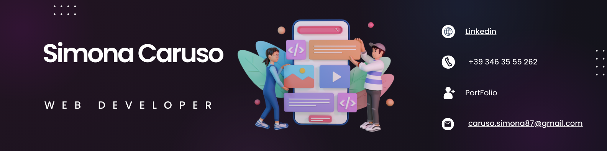

	

<h1 align="center">👋 Ciao, benvenuto nel mio profilo Github!</h1>

 

:computer: Mi chiamo <strong>Simona</strong>, ho 36 anni , sono una <strong>JR FULL STACK WEB DEVELOPER</strong>.

	Appassionata di tecnologia, sviluppo e innovazione, ho avuto l'opportunità di fare un Master di programmazione con Boolean e spero che la mia passione diventi presto una professione. 

<h4>- 💡 Amo l'innovazione e le nuove tecnologie</h4>
<h4>- 🤝 Mi piace collaborare con altri programmatori</h4>

 

<h3>🔭 Cosa puoi trovare nel mio profilo?</h3>

 

Progetti realizzati da me, alcuni molto semplici che ho studiato all'inizio della mia formazione (alla fine si comincia tutti con "Hello World" :stuck_out_tongue_closed_eyes:), altri più complessi che mi hanno messa alla prova e che ho voluto condividere con voi :blush:.
 
<strong>Sentitevi liberi di visualizzarlo e lasciarvi ispirare o di contattarmi per qualsiasi domanda.</strong>

 

<h3>- 📫 Come metterti in contatto con me?</h3>

 

- [][linkedin] <strong>:rocket: Connettiti con il mio Linkedin</strong>

[linkedin]: https://www.linkedin.com/in/simona-caruso-developer

 

<h3>💻 Skills</h3>

 

	
	
	
	
	
	
	

	
	
	
	
	
	 

 

Grazie per aver visitato il mio account :wink:

<!--
**SimonaCaruso87/SimonaCaruso87** is a ✨ _special_ ✨ repository because its `README.md` (this file) appears on your GitHub profile.

Here are some ideas to get you started:

- 🔭 I’m currently working on ...
- 🌱 I’m currently learning ...
- 👯 I’m looking to collaborate on ...
- 🤔 I’m looking for help with ...
- 💬 Ask me about ...
- 📫 How to reach me: ...
- 😄 Pronouns: ...
- ⚡ Fun fact: ...
-->
